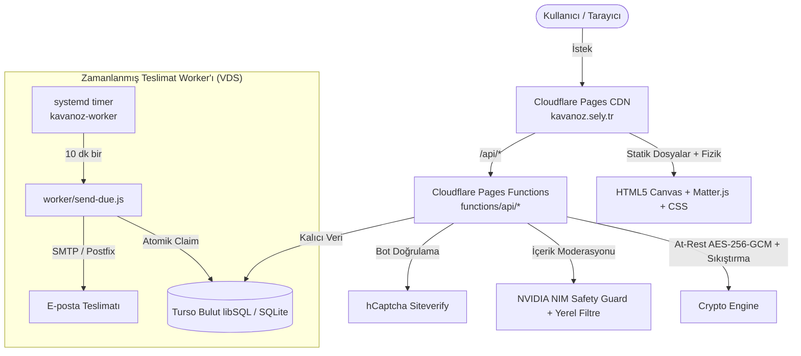

# Sanal Kavanoz

[](https://kavanoz.sely.tr)
[](LICENSE)
[](https://kavanoz.sely.tr)
[-00E599?style=flat-square&logo=sqlite&logoColor=white)](https://turso.tech)
[](https://brm.io/matter-js/)

Hesap gerektirmeyen, şifreli ve interaktif açık kaynaklı zaman kapsülü panosu. Herkes tek bir kavanoza not bırakır (anonim ya da adıyla), herkes tıklayıp okuyabilir. Kavanoz dolunca rafa kalkar, yeni bir kavanoz başlar.

[Canlı Demo](https://kavanoz.sely.tr) • [Özellikler](#özellikler) • [Mimari](#mimari) • [API Referansı](#api-referansı) • [Yerel Geliştirme](#kurulum-ve-yerel-geliştirme) • [Dağıtım](#dağıtım-deployment) • [Ortam Değişkenleri](#ortam-değişkenleri) • [Atıflar](#açık-kaynak-atıfları)

---

## Özellikler

- **Ortak Kavanoz & Raf Döngüsü:** Aktif kavanoz kapasiteye (`JAR_CAPACITY`) ulaştığında otomatik arşivlenir ("rafa kalkar"), yeni notlar sıradaki kavanoza düşer. Ziyaretçiler raflardaki geçmiş kavanozları keşfedebilir.
- **Matter.js İnteraktif Zarf Fiziği:** Kavanoz içine düşen renkli, kapalı zarflar HTML5 Canvas ve 2D rijit gövde simülasyonuyla yerçekimine ve sarsıntıya tepki verir; tıklanan zarf ilişkili notu açar.
- **Yönetim Anahtarı ile Hesap-Gerektirmeyen Yetkilendirme:** Not oluşturulduğunda kullanıcıya tek seferlik bir yönetim anahtarı verilir; sunucuda yalnızca SHA-256 hash'i tutulur. Bu anahtarla not sonradan silinebilir veya içeriği güncellenebilir (`POST /api/notes/manage`).
- **Gizli / Açık Not Seçeneği:** Notlar herkese açık veya yalnızca yönetim anahtarıyla içeriği görüntülenebilir gizli modda (`visibility: private`) bırakılabilir.
- **Gecikmeli E-posta Teslimatı (Zaman Kapsülü):** Kullanıcı dilerse notunun gelecekteki bir tarihte (5 yıla kadar) e-posta adresine gönderilmesini seçebilir. 7/24 çalışan arka plan süreci yerine atomik claim durum makinesi kullanan periyodik worker (`worker/send-due.js`) ile güvenli gönderim sağlanır.
- **Uçtan Uca At-Rest Şifreleme:** Not mesajı ve e-posta adresleri sunucuda **AES-256-GCM** algoritmasıyla şifreli olarak saklanır (`KAVANOZ_ENC_KEY`). Mesajlar ayrıca `zlib` ile sıkıştırılır.
- **İki Kademeli İçerik Moderasyonu:**
  - Yerel Türkçe filtre ile hızlı eleme (`server/wordlist.js`).
  - NVIDIA NIM AI Safety Guard (`llama-3.1-nemotron-safety-guard-8b-v3`) ile 23 güvenlik kategorisinde otomatik denetim (fail-closed).
  - hCaptcha entegrasyonu ile bot ve spam engelleme.
- **Çift Dilli Akıllı Arayüz:** Türkçe (`/`) ve İngilizce (`/en/`) rotaları, `localStorage` dil hafızası ve WCAG 2.1 AA erişilebilirlik uyumu.

---

## Mimari

Proje hem **Cloudflare Pages + Functions** (Edge / Serverless) ortamında 0 ms cold start ile global CDN üzerinde, hem de standart **Node.js / Express** (Docker, VPS) ortamında çalışacak hibrit bir mimariye sahiptir.



### Teknoloji Yığını

| Katman | Teknoloji | Sorumluluk |
| :--- | :--- | :--- |
| **Frontend** | Vanilla JS, HTML5 Canvas, SVG, Matter.js, CSS3 | 60 FPS zarf fiziği, duyarlı raflar ve çift dilli arayüz |
| **Edge API** | Cloudflare Pages Functions | `functions/api/*` (Serverless, global Edge dağıtımı) |
| **Node.js API** | Node.js, Express, Helmet, Rate Limit | `server/server.js` (Konteyner ve klasik sunucu dağıtımı) |
| **Worker** | Node.js Oneshot CLI | `worker/send-due.js` (Gecikmeli mail gönderimi ve saklama süresi temizliği) |
| **Veritabanı** | Turso (libSQL / SQLite) | Kalıcı bulut SQLite veritabanı, parametreli sorgular |
| **Şifreleme** | AES-256-GCM (`node:crypto` / Web Crypto) | Veritabanında at-rest şifreli e-posta ve mesaj saklama |
| **Moderasyon**| NVIDIA NIM & Yerel Kelime Filtresi | Yapay zekâ destekli içerik denetimi |
| **Bot Savunması** | hCaptcha | İstemci ve sunucu taraflı insan doğrulaması |

---

## API Referansı

| Metot | Uç Nokta | Açıklama | Yetkilendirme / Korumalar |
| :--- | :--- | :--- | :--- |
| `POST` | `/api/notes` | Yeni not oluşturur (aktif kavanoza ekler) | Rate limit (20/saat), hCaptcha, NIM Moderasyon |
| `GET` | `/api/jars/active` | Aktif kavanozun özetini ve doluluk oranını getirir | Herkese açık |
| `GET` | `/api/jars/shelf` | Raftaki arşivlenmiş kavanozların listesini getirir | Sayfalama desteği (`before`, `limit`) |
| `GET` | `/api/jars/:id/notes` | Belirtilen kavanozun notlarını listeler | Sayfalama desteği; gizli notlar kilitli döner |
| `GET` | `/api/notes/:id` | Tekil notun detayını getirir | Gizli notlarda mesaj maskelenir |
| `POST` | `/api/notes/manage` | Not sahibinin yönetim anahtarıyla işlem yapmasını sağlar | Rate limit (30/15dk), SHA-256 anahtar doğrulaması (`action: get \| update \| delete`) |
| `GET` | `/health` | Servis sağlık durum kontrolü | `{"ok": true}` |

---

## Kurulum ve Yerel Geliştirme

### 1. Depoyu Klonlayın
```bash
git clone https://github.com/dixtuel/kavanoz.git
cd kavanoz
```

### 2. Bağımlılıkları Yükleyin
```bash
npm install
```

### 3. Ortam Değişkenlerini Yapılandırın
```bash
cp .env.example .env
# .env dosyasını kendi anahtarlarınızla düzenleyin
```

### 4. Başlatma

#### Seçenek A: Node.js / Express ile Başlatma
```bash
npm start
# http://localhost:3030 adresinde çalışır
```

#### Seçenek B: Gecikmeli Gönderim Worker'ını Manuel Çalıştırma
```bash
npm run worker
```

#### Seçenek C: Cloudflare Pages / Wrangler ile Başlatma
```bash
npx wrangler pages dev public
```

---

## Dağıtım (Deployment)

### Cloudflare Pages (Önerilen Canlı Yol)
1. Projeyi GitHub reponuza push edin.
2. [Cloudflare Dashboard](https://dash.cloudflare.com) $\rightarrow$ **Workers & Pages** bölümünden yeni bir Pages projesi oluşturun.
3. Build ayarları:
   - **Framework Preset:** `None`
   - **Build output directory:** `public`
4. Ortam değişkenlerini (Environment Variables) tanımlayın (bkz. aşağıdaki tablo).
5. Veya CLI üzerinden direct-upload ile deploy edin:
   ```bash
   npx wrangler pages deploy public --project-name=kavanoz --commit-dirty=true
   ```

### Gecikmeli Gönderim Worker'ı (VDS / Linux systemd)
`worker/send-due.js` betiğini düzenli aralıklarla tetiklemek için `deploy/kavanoz-worker.service` ve `deploy/kavanoz-worker.timer` dosyalarını `/etc/systemd/system/` altına kopyalayıp etkinleştirin:
```bash
systemctl daemon-reload
systemctl enable --now kavanoz-worker.timer
```

---

## Ortam Değişkenleri

| Değişken | Zorunlu | Açıklama |
| :--- | :---: | :--- |
| `TURSO_DATABASE_URL` | Evet | Turso libSQL veritabanı bağlantı adresi (`libsql://...`) |
| `TURSO_AUTH_TOKEN` | Evet | Turso veritabanı erişim token'ı |
| `KAVANOZ_ENC_KEY` | Evet | At-rest şifreleme için 32-byte (64 hex karakter) AES-256 anahtarı |
| `HCAPTCHA_SITE_KEY` | Evet | hCaptcha genel site anahtarı (public) |
| `HCAPTCHA_SECRET` | Evet | hCaptcha gizli sunucu anahtarı (secret) |
| `NIM_API_KEY` | Evet | NVIDIA NIM API anahtarı |
| `NIM_MODEL` | Hayır | Moderasyon modeli (varsayılan: `nvidia/llama-3.1-nemotron-safety-guard-8b-v3`) |
| `NIM_TIMEOUT_MS` | Hayır | Moderasyon zaman aşımı süresi (varsayılan: `8000`) |
| `SMTP_HOST` | Hayır | E-posta gönderimi için SMTP sunucu adresi |
| `SMTP_PORT` | Hayır | SMTP portu (`587` veya `465`) |
| `SMTP_TLS_SERVERNAME` | Hayır | STARTTLS sertifika adı; boş bırakılırsa `SMTP_HOST` kullanılır |
| `MAIL_FROM` | Evet (mail için) | Giden e-postaların `From` başlığı; kodda varsayılan adres yoktur |
| `PUBLIC_BASE_URL` | Hayır | E-posta şablonlarında kullanılan site URL'i (`https://kavanoz.sely.tr`) |
| `CORS_ALLOWED_ORIGINS`| Hayır | İzin verilen CORS alan adları |
| `PORT` | Hayır | Node.js sunucu portu (varsayılan: `3030`) |

---

## Açık Kaynak Atıfları

Bu projede kullanılan harici açık kaynak kütüphaneler, yazı tipleri, simgeler ve tasarım referansları hakkında ayrıntılı bilgi için [ATTRIBUTION.md](ATTRIBUTION.md) dosyasını inceleyebilirsiniz.

---

## Lisans

Bu proje [MIT Lisansı](LICENSE) ile lisanslanmıştır.  
Copyright (c) 2026 **dixtuel**.
